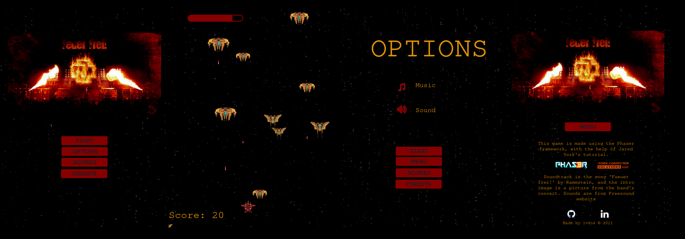

# Fueur frei!

This retro shooter is a simple platform game, a battle of spaceships with one player and the kinds of enemies.

## How to play

- Move using arrow keys (Left, Right, Up, and Down).
- Shoot lasers using Space.
- The player has 5 lives.
- The aim is to destroy as many enemies as possible.
- There are three kinds of enemies, giving 20, 50, and 100 points on destroying.
- Player's name can be submitted when the game is over.
- The best ten results are displayed in a Hall of Fame. Requirements.
- Music and sounds can be on or off and preference data is kept in local storage.

## Live Link

[Play game!](https://1v4n4.github.io/fueur-frei/)

## Built With

- Javascript
- Phaser
- Webpack
- Babel
- Jest

## Getting Started

To get a local copy up and running follow these simple steps.

### Prerequisites

Node and NPM packages.

### Setup

Get the link to the repository.
Clone it as `git clone https://github.com/1v4n4/fueur-frei`.
Install  dependencies with npm install

### Usage

Run `npm run build` in  Terminal to build the assets using webpack.
Run `npm start` in Terminal to start the server and look at the result in localhost:8080.

### Writing Code

After starting the development server with `npm start`, you can edit any files in the `src` folder and webpack will automatically recompile and reload your server (available at `http://localhost:8080` by default).

### Testing

The app uses Jest for testing. A command for running the tests that are located in the 'tests' folder is `npm test`.

## Acknowledgments

The game is named after the song 'Fueuer frei!'(Fire at will, translated) by German band [Rammstein](https://www.rammstein.de/en/). The same song is used for the soundtrack and the intro image is a picture from the band's concert. Buton, fire, and explosion sounds are from [Freesound](https://freesound.org/) website'.
Jared York's [tutorial](https://learn.yorkcs.com/category/tutorials/gamedev/phaser-3/build-a-space-shooter-with-phaser-3/) was very helpful while building the app.

## Author
**Ivana Novaković-Leković**

- GitHub: [@githubhandle](https://github.com/1v4n4)
- Twitter: [@twitterhandle](https://twitter.com/codeIv1)
- LinkedIn: [LinkedIn](https://www.linkedin.com/in/1v4n4/)

## Contributing

Contributions, issues, and feature requests are welcome!

Feel free to check the [issues page](https://github.com/1v4n4/fueur-frei/issues).

## License
MIT

## Show your support

Give a ⭐️ if you like this project!
